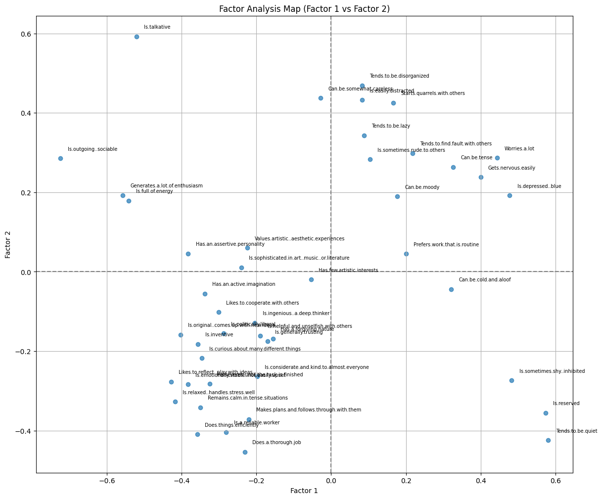

# Human behaviour Analysis – Factor Analysis (Python)
## Problem
Understand how human behaviour is attributaed to differet actions and identify underlying dimensions driving it.
## Data set
Is.talkative
Tends.to.find.fault.with.others
Does.a.thorough.job
Is.depressed..blue
Is.original..comes.up.with.new.ideas
Is.reserved
Is.helpful.and.unselfish.with.others
Can.be.somewhat.careless
Is.relaxed..handles.stress.well
Is.curious.about.many.different.things
Is.full.of.energy
Starts.quarrels.with.others
Is.a.reliable.worker
Can.be.tense
Is.ingenious..a.deep.thinker
Generates.a.lot.of.enthusiasm
Has.a.forgiving.nature
Tends.to.be.disorganized
Worries.a.lot
Has.an.active.imagination
Tends.to.be.quiet
Is.generally.trusting
Tends.to.be.lazy
Is.emotionally.stable..not.easily.upset
Is.inventive
Has.an.assertive.personality
Can.be.cold.and.aloof
Perseveres.until.the.task.is.finished
Can.be.moody
Values.artistic..aesthetic.experiences
Is.sometimes.shy..inhibited
Is.considerate.and.kind.to.almost.everyone
Does.things.efficiently
Remains.calm.in.tense.situations
Prefers.work.that.is.routine
Is.outgoing..sociable
Is.sometimes.rude.to.others
Makes.plans.and.follows.through.with.them
Gets.nervous.easily
Likes.to.reflect..play.with.ideas
Has.few.artistic.interests
Likes.to.cooperate.with.others
Is.easily.distracted
Is.sophisticated.in.art..music..or.literature
Is.politically.liberal
## Approach
- Cleaned and standardized survey data
- Applied Factor Analysis using scikit-learn
- Visualized results using a perceptual (factor) map
- ## Key Insights
- It was categogorized into two dimensions
- Factor 1 - Extrovert vs Introvert qualities
- Factor 2 - Responsible vs disorganized

The most important takeaway is that
1.  **How outgoing, energetic, and emotionally stable a person is (Extraversion/Introversion and aspects of Neuroticism).**
2.  **How organized, reliable, and disciplined a person is (Conscientiousness).**
Instead of trying to understand someone based on 25 individual traits,We can get a very good picture by knowing where they stand on these two broad factors. This aligns well with established psychological models like the Big Five personality traits, where Extraversion and Conscientiousness are two of the most robust dimensions.
- ## Factor Map Visualization

- ## Tools
Python, Pandas, Scikit-learn, Matplotlib
## Output
- Factor loading table
- 2D perceptual map visualizing customer perception clusters
